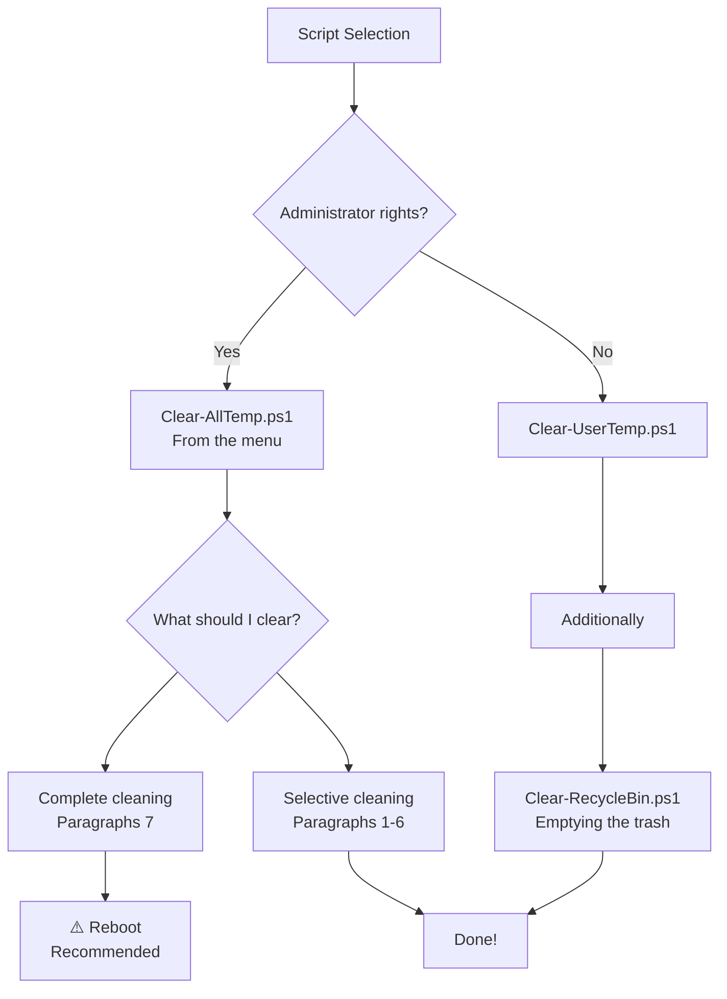

# 🧹 Windows Temp Cleaner - A set of PowerShell scripts for cleaning temporary files
https://img.shields.io/badge/PowerShell-5.1+-blue.svg https://img.shields.io/badge/Windows-10%252F11%252FServer-success.svg https://img.shields.io/badge/License-MIT-green.svg https://img.shields.io/badge/Version-2.0.0-orange.svg

A set of standalone PowerShell scripts for safely cleaning temporary files in Windows. Each script performs a specific task.

# ✨ Features
- ✅ Modularity - each script is independent and performs a single task
- ✅ Informative - a detailed report on the implementation
- ✅ Flexibility - can be used separately or in combination
- ✅ Support - Windows 10/11/Server 2016+

# 📁 List of scripts
| Script | Description | Admin rights | Danger  |
| ------ | ----------- | ------------ | ------- |
| [Clear-UserTemp.ps1](https://github.com/S1mvolxD/PowerShell-Scripts/blob/main/System/Clear-UserTemp.ps1) | Clearing the user's temporary files | ❌ | ⭐|
| [Clear-SystemTemp.ps1](https://github.com/S1mvolxD/PowerShell-Scripts/blob/main/System/Clear-SystemTemp.ps1) | Cleaning system temporary files | ✅ | ⭐⭐|
| [Clear-RecycleBin.ps1](https://github.com/S1mvolxD/PowerShell-Scripts/blob/main/System/Clear-RecycleBin.ps1) | Emptying the trash | ❌ | ⭐⭐⭐|
| [Clean-Menu.ps1](https://github.com/S1mvolxD/PowerShell-Scripts/blob/main/System/Clean-Menu.ps1) | Script with a menu | ✅/❌ | ⭐⭐⭐⭐|

# 🚀 Quick start
```ps1
irm https://raw.githubusercontent.com/S1mvolxD/Windows-Temp-Cleaner/refs/heads/main/System/Clean-Menu.ps1 | iex
```

# 🔧 Detailed description of the scripts
<details>
  
<summary>1. Clear-UserTemp.ps1 - Clearing user temporary files</summary>

## What cleanses:
```ps1
• %TEMP% and %LOCALAPPDATA%\Temp
• Browser cache (Edge, Chrome, Firefox)
```

</details>

<details>
<summary>2. Clear-SystemTemp.ps1 - Cleaning system temporary files</summary>

## What cleanses:
```ps1
• C:\Windows\Temp
• System Temp profiles
• CBS logs
• Update files
• Installer cache
```

</details>

<details>

<summary>3. Clear-RecycleBin.ps1 - Cleaning the Recycle Bin</summary>

## What cleanses:
```ps1
• Completely cleans the trash
• Shows the size of the vacated space
```

</details>

> [!WARNING]
> Urgent info that needs immediate user attention to avoid problems.

# 📊 Script Comparison


# 🚨 What will NOT be deleted:
- ✔️ Files in use by systems
- ✔️ Important system files
- ✔️ User's documents
- ✔️
    
# 📞 Support
Did you find a bug? Do you have any suggestions? Create an Issue

Attention: These scripts are provided "as is". The author is not responsible for possible problems. Always create backups of important data before performing any cleanup operations.
