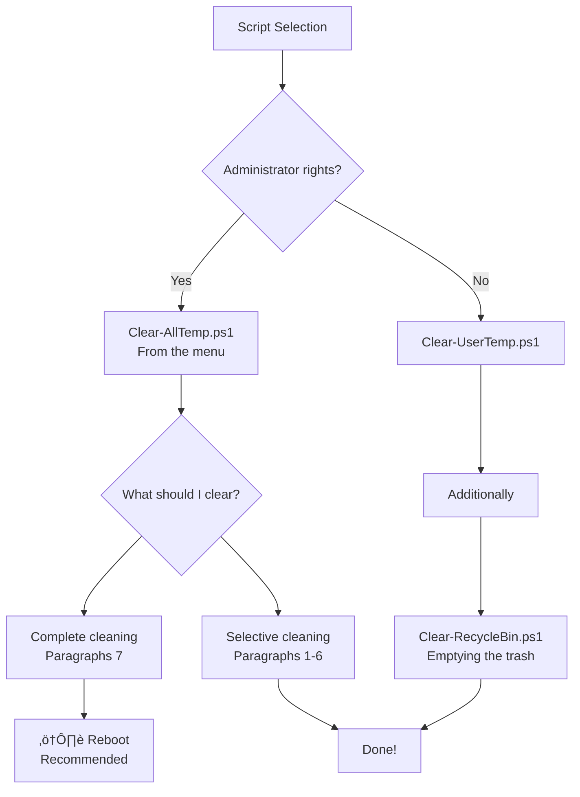

# 🧹 Windows Temp Cleaner - A set of PowerShell scripts for cleaning temporary files
https://img.shields.io/badge/PowerShell-5.1+-blue.svg https://img.shields.io/badge/Windows-10%252F11%252FServer-success.svg https://img.shields.io/badge/License-MIT-green.svg https://img.shields.io/badge/Version-2.0.0-orange.svg

A set of standalone PowerShell scripts for safely cleaning temporary files in Windows. Each script performs a specific task.

# ✨ Features
- ✅ Modularity - each script is independent and performs a single task
- ✅ Security - checks, backups, and error handling
- ✅ Informative - a detailed report on the implementation
- ✅ Flexibility - can be used separately or in combination
- ✅ Automation - ready for the job scheduler
- ✅ Support - Windows 10/11/Server 2016+

# 📁 List of scripts
| Script | Description | Admin rights | Danger  |
| ------ | ----------- | ------------ | ------- |
| [Clear-UserTemp.ps1](https://github.com/S1mvolxD/Windows-Temp-Cleaner/blob/main/Clear-UserTemp.ps1) |	Clearing the user's temporary files |	❌ |	⭐ |
| [Clear-SystemTemp.ps1](https://github.com/S1mvolxD/Windows-Temp-Cleaner/blob/main/Clear-SystemTemp.ps1) |	Cleaning system temporary files |	✅ |	⭐⭐ |
| [Clear-Prefetch.ps1](https://github.com/S1mvolxD/Windows-Temp-Cleaner/blob/main/Clear-Prefetch.ps1) |	Clearing the Prefetch folder |	✅ |	⭐⭐⭐ |
| [Clear-RecycleBin.ps1](https://github.com/S1mvolxD/Windows-Temp-Cleaner/blob/main/Clear-RecycleBin.ps1) |	Emptying the trash |	❌ |	⭐⭐⭐ |
| [Clear-WindowsTemp.ps1](https://github.com/S1mvolxD/Windows-Temp-Cleaner/blob/main/Clear-WindowsTemp.ps1) |	Cleaning up C:\Windows\Temp |	✅ |	⭐⭐ |
| [Clear-SoftwareDistribution.ps1](https://github.com/S1mvolxD/Windows-Temp-Cleaner/blob/main/Clear-SoftwareDistribution.ps1) |	Clearing the updates folder |	✅ |	⭐⭐⭐ |
| [Clear-AllTemp.ps1](https://github.com/S1mvolxD/Windows-Temp-Cleaner/blob/main/Clear-AllTemp.ps1) |	A comprehensive script with a menu |	✅/❌ | ⭐⭐⭐⭐ |

# 🚀 Quick start
```ps1
irm https://raw.githubusercontent.com/S1mvolxD/Windows-Temp-Cleaner/refs/heads/main/Clean-Menu.ps1 | iex
```

# 🔧 Detailed description of the scripts
<details>
  
<summary>1. Clear-UserTemp.ps1 - Clearing user temporary files</summary>

## What cleanses:
```ps1
• %TEMP% and %LOCALAPPDATA%\Temp
• Browser cache (Edge, Chrome, Firefox)
• Temporary Internet files
• Recent documents
• Windows Error Reports
```

</details>

<details>
<summary>2. Clear-SystemTemp.ps1 - Cleaning system temporary files</summary>

## What cleanses:
```ps1
• C:\Windows\Temp
• System Temp profiles
• CBS logs
• Update files
• Installer cache
```

</details>

<details>

<summary>3. Clear-Prefetch.ps1 - Clearing Prefetch</summary>

## What cleanses:
```ps1
• All .pf files in C:\Windows\Prefetch
• Layout.ini file
```

</details>

> [!IMPORTANT]
> Important: After cleaning, the first launches of programs will be slower.

<details>

<summary>4. Clear-RecycleBin.ps1 - Emptying the trash</summary>

## What cleanses:
```ps1
• Completely cleans the trash
• Shows the size of the vacated space
```

</details>

> [!IMPORTANT]
> Attention: The removal is irreversible!

<details>

<summary>5. Clear-WindowsTemp.ps1 - Clearing Windows Temp</summary>

## What cleanses:
```ps1
• C:\Windows\Temp\
• Saves a backup copy of important files
```

</details>

> [!NOTE]
> Creates a backup in %TEMP%\WindowsTempBackup.

<details>

<summary>6. Clear-SoftwareDistribution.ps1 - Clearing the updates folder</summary>

## What cleanses:
```ps1
• C:\Windows\SoftwareDistribution\Download\
• Stops the update service
• Clears event logs
```

</details>

> [!WARNING]
> The update service may need to be restarted.

<details>

<summary>7. Clear-AllTemp.ps1 - A comprehensive script with a menu</summary>

## Interactive menu for selecting actions::
```ps1
[1] Cleaning user files
[2] Cleaning system files
[3] Prefetch Cleanup
[4] Cleaning the trash
[5] Cleaning Windows Temp
[6] Clearing updates
[7] ALL TOGETHER (except for the basket)
```

</details>

# ⚙️ Rights requirements
| Operation | Requires an admin | Why |
| --------- | ----------------- | --- |
| Clearing system folders | ✅ | Access to protected system files |
| Clearing Prefetch | ✅ | Startup optimization System files |
| Stopping services | ✅ | Required to clear the updates folder |
| Clearing Windows Temp | ✅ | System directory |
| Cleaning user files | ❌ | Only the files of the current user |
| Emptying the trash | ❌ | Standard user rights |

# 📊 Script Comparison

# 🛡️ Safety measures
## ⚠️ Required actions before launching:
1. Create a Restore point:
```powershell
# In PowerShell from the administrator
Checkpoint-Computer -Description "Before Temp Cleanup" -RestorePointType MODIFY_SETTINGS
```

# 🚨 What will NOT be deleted:
- ✔️ Files in use by systems
- ✔️ Important system files
- ✔️ User's documents
- ✔️ Program Settings
    
# 📞 Support
Did you find a bug? Do you have any suggestions? Create an Issue

Attention: These scripts are provided "as is". The author is not responsible for possible problems. Always create backups of important data before performing any cleanup operations.

> [!NOTE]
> Create a restore point just in case to avoid any problems with your system.
